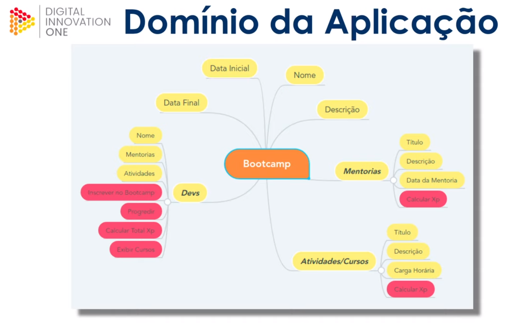

# BootcampDIO

# Sobre o projeto
BootcampDIO é um desafio proposto pela instrututa Camila Cavalcante na plataforma DIO - Digital Innovation One. Consiste em abstrair um bootcamp usando linguagem 
Java e conceitos de orientação a objetos (abstração, polimorfismo, encapsulamento, herança).

## Dominio da aplicação

# Tecnologias utilizadas
## Back end
- Java 17
- Spring Tool Suite 4
